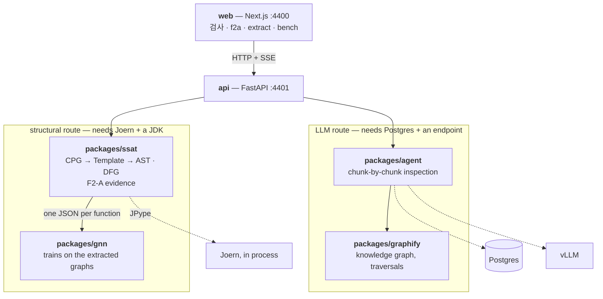

# Static Software Analysis Tool (SSAT)

Finds vulnerabilities in source by two independent routes: a **structural** one
built on [Joern](https://joern.io) Code Property Graphs, and an **LLM** one that
reads the code function by function. Neither depends on the other — `agent`
imports neither `ssat` nor `gnn` — and both are reachable from one API and one
web UI.



## Packages

| | what it is | read next |
| --- | --- | --- |
| `packages/ssat` | CPG → Template → per-function AST and def-use DFG, plus **F2-A** OCPP evidence extraction. The `ssat` CLI. | [README](packages/ssat/README.md) |
| `packages/agent` | Chunk-by-chunk LLM inspection over an OpenAI-compatible endpoint. The `agent` CLI. | [README](packages/agent/README.md) |
| `packages/gnn` | Trains GNNs on what `ssat full` extracts. A consumer, not a stage. | [README](packages/gnn/README.md) |
| `packages/graphify` | Knowledge graph over an indexed tree; the traversals the agent's MCP tools expose. | [README](packages/graphify/README.md) |
| `packages/schemagen` | JSON Schema → TypeScript, so a wire type is defined once. | [README](packages/schemagen/README.md) |
| `api` | FastAPI on :4401 — structural routes plus `/agent/*`. | [README](api/README.md) |
| `web` | Next.js on :4400 — 검사, f2a, extract, bench. | [README](web/README.md) |

`docs/v2/` holds the F2-A design documents. Nothing in `artifacts/` is source —
delete any of it and the repo still builds.

## Prerequisites

- Python 3.14+ and [uv](https://docs.astral.sh/uv/)
- A local **Joern** install and a **JDK** — Joern's JARs run in this process
  via JPype. Point `JOERN_HOME` at the `joern-cli` directory (it defaults to
  `/usr/bin/joern/joern-cli`). There is no container alternative any more.
- Node 20+ for the web UI

## Quick start

```bash
uv sync                       # Python workspace
source .venv/bin/activate     # or prefix each command with `uv run`
```

### Structural — needs Joern and a JDK

```bash
ssat f2a  path/to/file.c      # OCPP evidence candidates
ssat full path/to/file.c      # AST + DFG per function
```

Output lands in `result/<mode>_<timestamp>/` unless you pass `-o`.

### LLM inspection — needs Postgres and a model endpoint

```bash
cp .env.example .env                               # model, GPUs, weights path
docker compose up -d --wait postgres               # the run database
docker compose --profile vllm up -d --wait vllm    # the model server, on :4403
agent corpus ingest                                # the corpus of known weaknesses

agent inspect path/to/src -v                       # minutes, not seconds
```

Or open `/agent` in the web UI. Give it a folder, a `.zip` or a git URL, and
findings stream in as they are found: severity, CWE, the code, the evidence
trail, and a patch for those exact lines. Tick the ones that matter and the
bucket becomes a unified `.patch`, a patched `.zip`, or a pushed branch.

**Nothing is ever applied to the analysed tree.** That is what keeps a finding's
anchor meaningful afterwards and a patch reproducible; the fix leaves as a diff.

Model choice, GPU sizing and how to read the output:
[`packages/agent/README.md`](packages/agent/README.md).

## CLI

`ssat` is one command with a subcommand per stage; `agent` is the LLM route's.
Both are documented in their own packages —
[ssat](packages/ssat/README.md#stages), [agent](packages/agent/README.md#cli).

## Web UI and API

```bash
# The API on :4401. --reload-dir and --timeout-graceful-shutdown are both
# load-bearing; api/README.md says why.
uv run uvicorn api.main:app --host 0.0.0.0 --port 4401 \
  --reload --timeout-graceful-shutdown 2 \
  --reload-dir api --reload-dir packages/ssat/src/ssat \
  --reload-dir packages/agent/src/agent --reload-dir packages/graphify/src/graphify

cd web && pnpm dev          # Next.js on :4400
```

The API exposes `/cpg-jpype`, `/template`, `/ast`, `/dfg`,
`/analyze-functions`, `/f2a`, `/analyze` and `/health`. `GET /health` reports
whether Joern can run on this host.

Note the UI derives AST/CFG/DFG/CG *views* from a CPG client-side, by edge
label. Those are a different thing from the `/ast` and `/dfg` endpoints, which
return the SSAT pipeline's own artifacts.

## Development

```bash
uv run poe               # the list, with what each one does
uv run poe check         # lint, types, Python tests, then the web gate
uv run poe dev           # the API and the web app together
uv run poe stack         # what is running right now
```

The task list is `[tool.poe.tasks]` in the root `pyproject.toml`. Nothing is
hidden behind it — every task is the real command, and CI calls the tools
directly so a mistake in the task list cannot turn a build green.

Containers, golden snapshots, why `prod-api` must stay single-process, and the
rest: [docs/development.md](docs/development.md).

## Notes

- **Two DFGs, one survivor.** The DFG here is a def-use analysis: it tracks
  memory reads and writes, buffer access, sink classification and guard bounds.
  An earlier second implementation only projected CPG `REF` edges — a filter,
  not an analysis — and has been removed.
- **One CPG engine, in this process.** There was a second that ran `docker
  exec` into a Joern container, which meant a second Joern to keep in step with
  the first — and they had drifted, 4.0.377 locally against the container's
  pinned 4.0.361. The container, the `/cpg-docker` endpoint, the `--backend`
  flag and the test that measured the skew are all gone. The cost is that a
  host with no local Joern can no longer generate a CPG.
- **F2-A is frozen.** See `docs/v2/f2a-milestone-status.md`. Its knowledge base
  (`ssat/f2a/kb.py`) is OCPP protocol semantics and is deliberately separate
  from `ssat/knowledge/`, which holds libc memory facts.
- **The agent locates findings by quoting, not by line number.** Models get line
  numbers wrong, so a finding names the offending source text and the server
  finds it. If it cannot be found, the finding is dropped rather than pointed at
  a guessed line.
- **The generated `web/lib/agent-schema.ts` is not hand-edited.** It comes from
  the pydantic wire models via `python -m agent.schema_ts --write`, and a test
  fails if the two drift.
