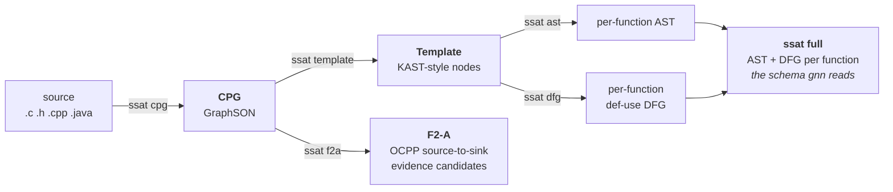

# ssat — structural analysis over Joern CPGs

Turns source into a Code Property Graph and then into the artifacts the rest of
the repo consumes: per-function ASTs and def-use DFGs for the GNN trainer, and
**F2-A** evidence candidates for OCPP payload handling.

Joern runs **in this process** through JPype — no container, no server.



## Quick start

```bash
uv sync && source .venv/bin/activate
export JOERN_HOME=/usr/bin/joern/joern-cli    # if it is not there already

ssat                            # pick the stage and the paths by arrow key
ssat full path/to/src --ext c   # or type it: AST + DFG per function
ssat f2a  path/to/cpg           # OCPP evidence candidates, from a CPG
```

`ssat` with no arguments on a terminal asks instead of printing a usage error:
arrow keys through the stages, then through the tree to the input and the
output directory, then the options that stage actually has. It prints the
command it assembled before running it, so the next time you can type it. One
of the stage choices is `cpg+full`, which runs the two in order and leaves the
CPG behind for `ast`, `dfg` and `f2a` to reuse.

Output lands in `result/<mode>_<timestamp>/` unless you pass `-o`.

Every stage after `cpg` reads a CPG, so `--ext` defaults to `json`. Point one
at source and pass `--ext c` (or `c,cpp,h`) or it finds nothing to do — the CPG
is then generated in memory and thrown away. The menu picks `--ext` from what
you selected, so interactively this cannot go wrong.

## Stages

| command | in | out |
| --- | --- | --- |
| `ssat cpg` | source | CPG (GraphSON) |
| `ssat template` | CPG | Template nodes |
| `ssat ast` | CPG | per-function AST |
| `ssat dfg` | CPG | per-function def-use DFG |
| `ssat full` | CPG | AST + DFG per function, in the schema `gnn` reads |
| `ssat template-functions` | CPG | one file per function node of the Template |
| `ssat f2a` | CPG | OCPP evidence candidates |

One command, one subcommand per stage:

```
ssat cpg                 source        -> CPG (GraphSON)
ssat template            CPG           -> Template nodes
ssat ast                 CPG           -> per-function AST
ssat dfg                 CPG           -> per-function def-use DFG
ssat full                CPG           -> AST + DFG per function (GNN schema)
ssat template-functions  CPG           -> one file per function node of the Template
ssat f2a                 CPG           -> OCPP evidence candidates
```

The input path is positional. Every subcommand also takes `-o/--output`;
`--workers` parallelises CPG generation only.

Joern runs in the process that asks for it, JARs loaded through JPype, so no
container is involved anywhere. `ssat cpg` over a directory is a process pool
and each worker starts its own JVM — one JVM cannot be shared across processes
— so `--workers 4` means four of them, and the memory to match. Without JARs to
load the command stops before doing any work and says to set `JOERN_HOME`.

The five stages that build a Template also take `--no-replace-macro`. Joern runs
no preprocessor: it models a `#define` as a function and each use of it as a
call, inlining the expansion beneath the use site. By default that pseudo-call
is folded into its expansion, so `if (len < MAX)` carries a real bound and a
macro-wrapped `strcpy` is attributed to `strcpy`. The flag leaves the
pseudo-call in place, which is the shape templates written before this produced.

## F2-A

OCPP-native evidence extraction: does an untrusted payload field reach a
dangerous sink without an adequate check, and what is the evidence trail. It is
self-contained in `src/ssat/f2a/` and has its own knowledge base — `f2a/kb.py`
is OCPP protocol semantics, deliberately separate from `ssat/knowledge/`, which
holds libc memory facts.

**F2-A is frozen.** The design documents and what was and was not finished are
in [`docs/v2/`](../../docs/v2), starting with
[`f2a-milestone-status.md`](../../docs/v2/f2a-milestone-status.md).

## Layout

```
src/ssat/
  cpg/          CPG generation: Joern in this process, via JPype
  template/     CPG -> Template (KAST-style) conversion
  ast/          Template -> per-function AST
  dfg/          AST -> per-function def-use DFG
  knowledge/    shared C stdlib facts (sinks, allocators, bounds)
  f2a/          F2-A evidence extraction (self-contained)
  pipeline/     stage orchestration + artifact writing
  nodes/  types/  utils/
  cli/          the `ssat` command
tests/          pytest suite + golden snapshots
```

## Golden snapshots

`tests/golden/` records the exact AST and DFG the pipeline produces for every
CPG fixture. They answer *"did this change?"*, never *"is this correct?"* — a
diff there is a regression unless the change was deliberate, in which case
regenerate and review the diff:

```bash
python packages/ssat/tests/generate_golden.py
```
